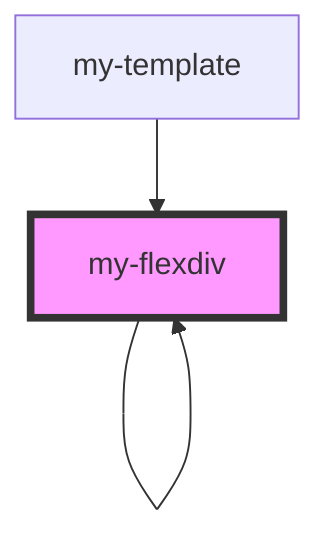

# my-component

<!-- Auto Generated Below -->

## Dependencies

### Used by

 - [my-flexdiv](.)
 - [my-template](../my-template)

### Depends on

- [my-flexdiv](.)

### Graph

----------------------------------------------

*Built with [StencilJS](https://stenciljs.com/)*
