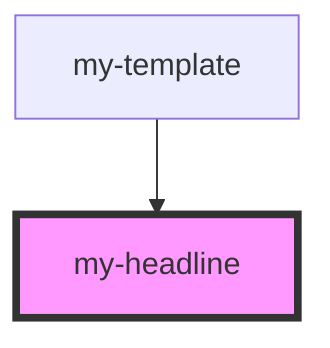

# my-headline

<!-- Auto Generated Below -->

## Properties

| Property  | Attribute | Description | Type     | Default     |
| --------- | --------- | ----------- | -------- | ----------- |
| `article` | `article` |             | `string` | `undefined` |
| `name`    | `name`    |             | `string` | `undefined` |

## Dependencies

### Used by

 - [my-template](../my-template)

### Graph

----------------------------------------------

*Built with [StencilJS](https://stenciljs.com/)*
