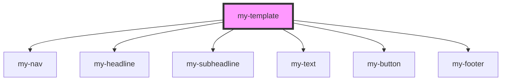

# my-component

<!-- Auto Generated Below -->

## Dependencies

### Depends on

- [my-nav](../my-nav)
- [my-headline](../my-headline)
- [my-subheadline](../my-subheadline)
- [my-text](../my-text)
- [my-button](../my-button)
- [my-footer](../my-footer)

### Graph

----------------------------------------------

*Built with [StencilJS](https://stenciljs.com/)*
