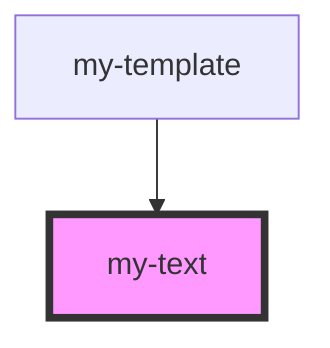

# my-text

<!-- Auto Generated Below -->

## Properties

| Property  | Attribute  | Description    | Type      | Default     |
| --------- | ---------- | -------------- | --------- | ----------- |
| `defText` | `def-text` | The first name | `boolean` | `undefined` |

## Dependencies

### Used by

 - [my-template](../my-template)

### Graph

----------------------------------------------

*Built with [StencilJS](https://stenciljs.com/)*
